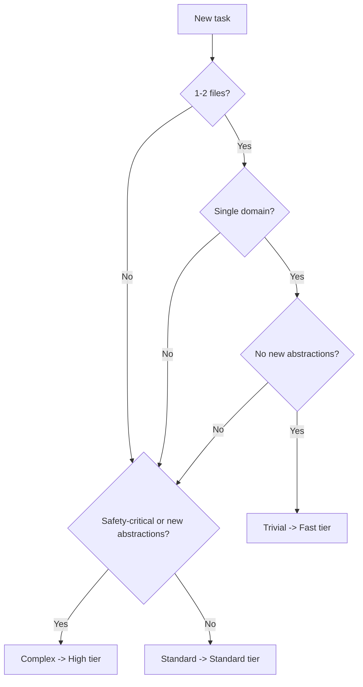
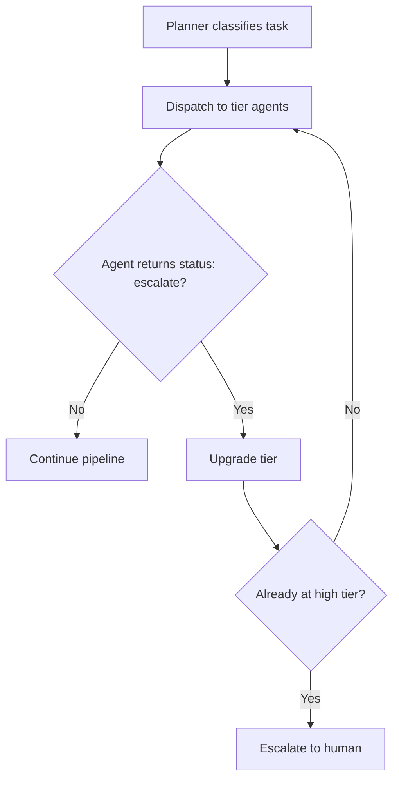

# Expert Tier

**This tier answers: Can you architect AI systems and lead others?**

Like teaching others to drive and designing better roads -- you understand the system well enough to improve it and help others navigate it.

Copy this directory into your project as `.cursor/` for tiered agent routing with cost-optimized model selection.

```bash
cp -r .cursor-expert/* your-project/.cursor/
```

## Learning objectives

After reading this, you will understand how to:
- Classify task complexity and route to the right agent tier
- Handle escalation when a lower-tier agent is insufficient
- Orchestrate multi-issue specs across pipeline runs
- Track pipeline cost and optimize model selection
- Design agent architectures with monitoring and cost optimization
- Produce architecture proposals for client teams

## Cursor documentation

Key references for the concepts covered in this tier:

- [Custom Agents | Cursor Docs](https://docs.cursor.com/agent/custom-agents) -- Agent tiers, model assignment, `subagent_type` dispatch for tiered routing
- [Customizing Agents | Cursor Learn](https://cursor.com/learn/customizing-agents) -- Creating and managing custom agent definitions
- [Rules | Cursor Docs](https://docs.cursor.com/context/rules) -- `.mdc` rules that encode tier routing logic and pipeline behavior
- [Agent Skills | Cursor Docs](https://docs.cursor.com/context/skills) -- `SKILL.md` for benchmark operations and artifact I/O
- [Developing Features | Cursor Learn](https://cursor.com/learn/creating-features) -- Feature development across tiers
- [Finding and Fixing Bugs | Cursor Learn](https://cursor.com/learn/finding-and-fixing-bugs) -- Debugging and escalation patterns
- [Reviewing and Testing Code | Cursor Learn](https://cursor.com/learn/reviewing-and-testing-code) -- Tiered review workflows

## Tiered model strategy

Different tasks need different models. A typo fix doesn't need the same reasoning power as a WebSocket implementation:

| Tier | When to use | Model cost | Retry risk |
|------|------------|------------|------------|
| **Fast** | Single-file, single-domain, no new abstractions | Low | Higher (but cheap to retry) |
| **Standard** | Multi-file, cross-domain, standard patterns | Medium | Moderate |
| **High** | Safety-critical, new abstractions, architectural | High | Low (premium prevents rework) |

The cost of a wrong-tier assignment: too low = rework cycles that consume more tokens than the premium model would have; too high = wasted spend on trivial tasks.

## Complexity classification



Examples:
- **Trivial**: fix typo, update config, add simple getter, rename variable
- **Standard**: add API endpoint with tests, refactor module, implement feature per spec
- **Complex**: add auth/authz, design data pipeline, implement WebSocket layer, add rate limiting

## Routing and escalation



Escalation is not counted as a retry. When `jg-worker-fast` returns `status: escalate` because the task requires multi-file changes, the planner dispatches `jg-worker` (standard) without consuming a retry.

See [Towards self-driving codebases](https://cursor.com/blog/self-driving-codebases) from the Cursor team:
- Their research arrived at the same planner -> subplanner -> worker hierarchy
- "Self-coordination failed quickly" validates why structured roles with defined routing matter
- "Constraints are more effective than instructions" validates the NON-GOALS sections in each agent
- "Design for throughput explicitly" validates the cost/quality tradeoff in tiered routing

## Agents (15 total)

See [AGENTS.md](AGENTS.md) for the full index with tier assignments and I/O mapping.

| Agent | Tier | Role |
|-------|------|------|
| jg-planner | -- | Orchestrates pipeline, classifies complexity, routes to tiers |
| jg-subplanner | Standard | Decomposes issues into ordered plans |
| jg-subplanner-high | High | Plans with dependency graphs and risk analysis |
| jg-worker-fast | Fast | Single-file edits; escalates if exceeds scope |
| jg-worker | Standard | Multi-file implementation |
| jg-worker-high | High | Complex features with risk assessment |
| jg-tester-fast | Fast | Phase 1 only (lint, typecheck, unit tests) |
| jg-tester | Standard | Phase 1 + Phase 2 verification |
| jg-reviewer-fast | Fast | Scope check and lint-level review |
| jg-reviewer | Standard | Full quality gate |
| jg-reviewer-high | High | Architecture and security review |
| jg-debugger | Standard | Failure classification and diagnosis |
| jg-debugger-high | High | Multi-causal, cross-module analysis |
| jg-git | -- | Branch, commit, PR |
| jg-benchmarker | -- | Model cost/performance evaluation |

## Multi-issue orchestration

For spec-driven work spanning multiple issues:

1. **Split the spec into ordered issues** with clear acceptance criteria and dependencies
2. **Run one pipeline per issue** in dependency order
3. **Track progress** with issue labels or a project board
4. **Resume interrupted runs** by pointing the planner at `.pipeline/<issue-id>/` -- it reads `state.yaml` and the latest artifact to continue from the right stage

### State management

`state.yaml` in `.pipeline/<issue-id>/` tracks:
- Current stage and status
- Acceptance criteria with verification status
- Per-stage results and agent used
- Retry count and routing decisions

### Dependencies between issues

- **Linear**: Issue A -> B -> C. Start B after A is merged.
- **Fan-out**: Issues B, C, D all depend on A but not each other. Run in parallel after A.
- **Tracking**: Use labels (`status:ready`, `status:in-progress`, `status:done`) or a board. The planner can pick the next ready issue.

See `walkthrough/scenario.md` for a worked example with 3 issues.

## Monitoring

### lessons.yaml

Cross-run failure patterns. The planner reads `.pipeline/lessons.yaml` at pipeline start to avoid repeating known mistakes:

```yaml
- date: "2026-02-20"
  issue: "NOTIF-002"
  pattern: "Missing null check on optional user fields"
  frequency: 3
  mitigation: "Always check optional fields before access"
```

### Success metrics

Track across pipeline runs:
- **Retry rate**: percentage of stages that need retry (target: <15%)
- **Escalation rate**: percentage of tasks that escalate tier (target: <10%)
- **Cost per issue**: token spend per completed issue
- **PR cycle time**: time from issue start to PR opened
- **Human intervention rate**: percentage of runs requiring human escalation

## What changed from Practitioner

| Addition | What it does |
|----------|-------------|
| **Tiered agents** | Each role has fast/standard/high variants with different models |
| **jg-tier-routing.mdc** | Explicit complexity classification and tier assignment |
| **Escalation** | Agents can return `status: escalate` to trigger tier upgrade |
| **Cost tracking** | Artifacts include `tier_used`, `cost_estimate`, `escalation_history` |
| **Multi-issue support** | State management for spec-driven work across sessions |
| **Enhanced pipeline validation** | schema.py validates tier fields; check.py validates routing consistency |

## Quickstart

1. Copy this directory into your project as `.cursor/`
2. Enable the models listed in `AGENTS.md` in `Cursor Settings > Models`. Some models (e.g. `gpt-5.1-codex-max`) are hidden by default. See [Models | Cursor Docs](https://cursor.com/docs/models).
3. Create an issue with acceptance criteria
4. Paste this into Cursor:

> "Work on issue #[number]. Classify the task complexity, select the appropriate agent tier, then run the full pipeline: plan, implement, test, review, and ship."

## Model fallbacks

| Agent | Default | Fallback |
|-------|---------|----------|
| jg-planner | gemini-3.1-pro | Any reasoning model |
| jg-subplanner[-high] | gpt-5.1-codex-max | Any code-capable model |
| jg-worker-fast | gemini-3-flash | Any fast model |
| jg-worker | gpt-5.3-codex | Any code-capable model |
| jg-worker-high | gpt-5.1-codex-max | Any code-capable model |
| jg-tester[-fast] | gemini-3-flash | Any fast model |
| jg-reviewer[-fast] | gemini-3-flash | Any fast model |
| jg-reviewer[-high] | gemini-3.1-pro | Any reasoning model |
| jg-debugger | claude-4.6-sonnet | Any reasoning model |
| jg-debugger-high | claude-opus-4.6 | Any reasoning model |
| jg-git | gemini-3-flash | Any fast model |
| jg-benchmarker | gemini-3-flash | Any fast model |

## Troubleshooting

**worker-fast escalated unexpectedly**
The task was more complex than the initial classification suggested. This is normal -- escalation is cheap and expected for borderline tasks.

**Cost higher than expected**
Check the routing log for frequent escalations. If most tasks escalate, your classification criteria may be too aggressive about assigning the fast tier.

**Debugger classified as "escalate" at high tier**
The failure is genuinely beyond agent capability. Review the `debug-diagnosis.json` manually.

**Pipeline doesn't resume**
Check `.pipeline/<issue-id>/state.yaml` exists and has the correct `current_stage`. If missing, the planner starts from scratch.

**Tiered agent not found**
Verify the agent file exists in `.cursor/agents/` and the filename in the planner's routing table matches exactly.

## Claude Code

Pipeline concepts (artifacts, roles, stage gates, tiered routing) are IDE-agnostic. Tiered agent dispatch is Cursor-specific (subagent architecture). In Claude Code, implement tier routing as sequential prompting with model selection:

| Cursor | Claude Code |
|--------|-------------|
| `.cursor/rules/*.mdc` | `CLAUDE.md` at repo root |
| `.cursor/agents/*.md` | Referenced docs in `CLAUDE.md` |
| `.cursor/skills/*/SKILL.md` | `.claude/commands/*.md` |
| `subagent_type` dispatch with tier | Model selection per prompt |
| `jg-tier-routing.mdc` | Routing logic in `CLAUDE.md` |

Walkthrough content and pipeline artifacts work in both environments.

## Tutorials

See `tutorials/` for 8 exercises. You will classify task complexity, route to tiered subagents, handle escalation, analyze costs, and produce an architecture proposal. See [tutorials/README.md](tutorials/README.md).

## Portfolio

Complete: 1 client architecture proposal (exercise 05), 1 presentation (walk-through of your tiered pipeline decisions), 1 mentorship session (guide someone through Foundation or Practitioner).

## Assessment

Peer review of your architecture proposal + vouching from someone you mentored through a lower tier.

## Maintenance

These files are derived from the root `.cursor/` bundle. When the bundle is updated, check this directory for changes.

## Walkthrough

The `walkthrough/` directory contains a 3-issue scenario: "Build a notification system."

| Issue | Complexity | Tier | Demonstrates |
|-------|-----------|------|-------------|
| [NOTIF-001](walkthrough/issue-1/) | Trivial | Fast | Fast-tier pipeline, all stages pass |
| [NOTIF-002](walkthrough/issue-2/) | Standard | Standard (escalated from fast) | Escalation from fast to standard tier |
| [NOTIF-003](walkthrough/issue-3/) | Complex | High | Full high-tier pipeline with risk assessment |

See [walkthrough/routing-log.md](walkthrough/routing-log.md) for annotated routing decisions and [walkthrough/cost-summary.md](walkthrough/cost-summary.md) for cost analysis across tiers.
