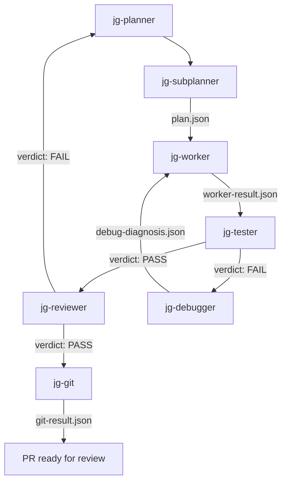

# Practitioner Tier

**This tier answers: Can you build and deploy AI features?**

Copy this directory into your project as `.cursor/` to use the full pipeline.

> For the full course material, exercises, and walkthroughs, see the [Practitioner docs page](https://jahnelgroup.github.io/multi-agents/practitioner/).

```bash
cp -r .cursor-practitioner/* your-project/.cursor/
```

## Quickstart

1. Copy this directory into your project as `.cursor/`
2. Enable the models listed in [AGENTS.md](AGENTS.md) in `Cursor Settings > Models`. See [Models | Cursor Docs](https://cursor.com/docs/models).
3. Create a GitHub issue with acceptance criteria
4. Paste this into Cursor:

> "Work on issue #[number]. Read the issue body and acceptance criteria. Plan the implementation, implement it, run tests, review the code, then create a branch, commit, and open a PR."

Artifacts appear under `.pipeline/<issue-id>/` as each stage completes.

## Pipeline flow



## Agents

See [AGENTS.md](AGENTS.md) for the full inventory with models and I/O mapping (8 agents: planner, subplanner, worker, tester, reviewer, debugger, git, benchmarker).

## Troubleshooting

**Tester failed but the code looks correct** -- Check that test commands match your project (e.g. `make test` vs `npm test` vs `pytest`).

**Debugger classified as "escalate"** -- Review `debug-diagnosis.json` manually; the failure is beyond agent capability.

**Reviewer keeps failing on scope** -- Check that `plan.json` `affected_files` matches what the worker actually changed.

**Agent didn't pick up a rule** -- Verify the file is in `.cursor/rules/` with valid frontmatter and an accurate `description`.

**Pipeline artifacts not appearing** -- Check `.pipeline/<issue-id>/` exists. The planner creates this directory at the start of a run.
