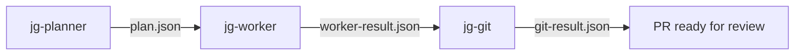

# Walkthrough: Add a Health Check Endpoint

!!! info "Read-only walkthrough"
    This is a read-only walkthrough showing what happens when you use the pipeline. You'll run the pipeline yourself in Practitioner exercises.

Here is what happens step by step when you use this pipeline:

## Pipeline overview



## Step 1: You paste a prompt

> "Work on issue HEALTH-01: Add GET /health endpoint that returns { status: 'ok' }."

Cursor reads your rules, sees `jg-planner-first`, and delegates to jg-planner.

## Step 2: Planner reads the issue and creates a plan

The planner identifies what needs to happen and writes `.pipeline/HEALTH-01/plan.json`:

```json
{
  "affected_files": ["src/routes/health.ts", "src/routes/health.test.ts"],
  "steps": [
    { "order": 1, "file": "src/routes/health.ts", "description": "Create GET /health route returning { status: 'ok' }" },
    { "order": 2, "file": "src/routes/health.test.ts", "description": "Test that GET /health returns 200 with expected body" }
  ]
}
```

## Step 3: Worker implements the plan

The planner dispatches jg-worker with the plan path. The worker reads `plan.json`, creates the files, and writes `.pipeline/HEALTH-01/worker-result.json`:

```json
{
  "status": "completed",
  "files_changed": ["src/routes/health.ts", "src/routes/health.test.ts"],
  "summary": "Created health check endpoint and test"
}
```

## Step 4: Git creates a branch, commits, and opens a PR

The planner dispatches jg-git. Git creates a branch, writes a conventional commit, opens a PR, and writes `.pipeline/HEALTH-01/git-result.json`:

```json
{
  "branch": "feature/health-01-health-endpoint",
  "commit_sha": "a1b2c3d",
  "pr_url": "https://github.com/org/repo/pull/12"
}
```

You review and merge the PR. Done.
