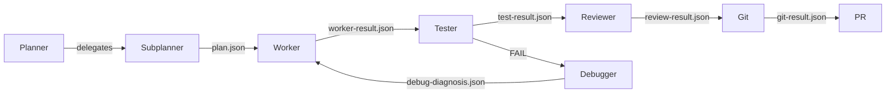

# Multi-Agent Pipeline Training

A structured training curriculum for building and operating multi-agent AI pipelines in Cursor. Learn concepts, practice hands-on, then design and architect.

## The pipeline

A multi-agent pipeline is a sequence of specialized agents that pass work forward via JSON artifacts. Each agent has a clear role; artifacts create traceable handoffs.

When tests fail, the **Debugger** diagnoses the issue and the **Worker** retries. The **Planner** orchestrates the full flow.

## Three tiers

-   **Foundation**

    ---

    _Can you understand and use AI effectively?_

    6 exercises — concepts and vocabulary

    [:octicons-arrow-right-24: Start Foundation](foundation/index.md)

-   **Practitioner**

    ---

    _Can you build and deploy AI features?_

    11 exercises — hands-on pipeline use

    [:octicons-arrow-right-24: Start Practitioner](practitioner/index.md)

-   **Expert**

    ---

    _Can you architect AI systems and lead others?_

    8 exercises — tiered routing and cost optimization

    [:octicons-arrow-right-24: Start Expert](expert/index.md)

## Who is this for?

Teams adopting AI-assisted development with **Cursor** or **Claude Code**. This curriculum teaches you how to set up multi-agent pipelines, delegate work to specialized agents, and scale from learning to production.

- [Getting Started](adoption/getting-started.md) — adoption guide
- [Quickstart](quickstart.md) — first pipeline in 5 minutes
- [Reference Cheat Sheet](reference/cheatsheet.md) — single-page quick reference
