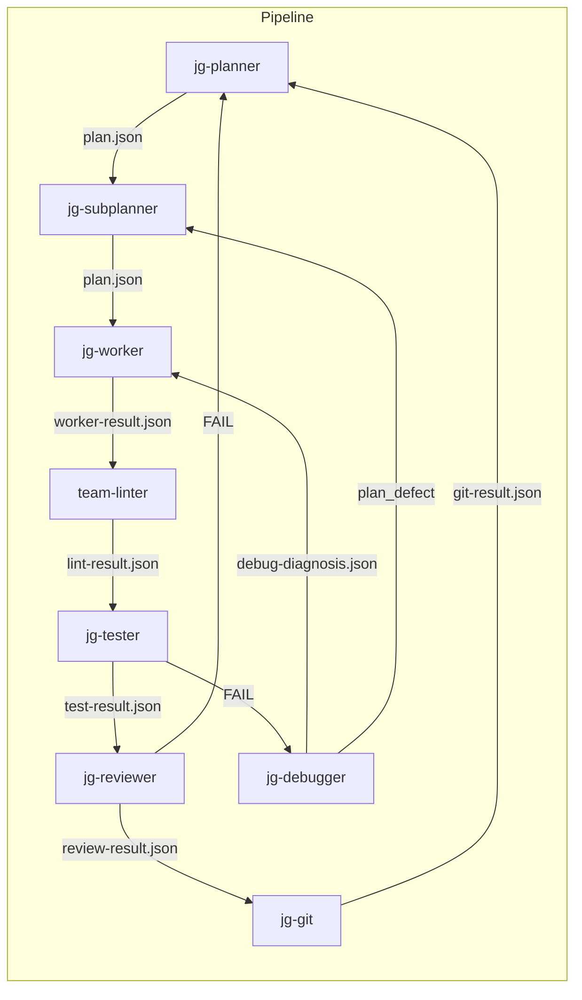

# Cheat Sheet

Single-page quick reference for the JG pipeline.

## Pipeline Flow



## Agent Table (Expert Tier)

| Name | Model | Role |
|------|-------|------|
| jg-planner | gemini-3.1-pro | Orchestrator |
| jg-subplanner | gpt-5.1-codex-max | Decompose issue → plan |
| jg-subplanner-high | gpt-5.1-codex-max | Plan with risk analysis |
| jg-worker-fast | gemini-3-flash | Single-file edits |
| jg-worker | gpt-5.3-codex | Multi-file implementation |
| jg-worker-high | gpt-5.1-codex-max | Complex implementation |
| jg-tester-fast | gemini-3-flash | Phase 1 only |
| jg-tester | gemini-3-flash | Phase 1 + Phase 2 |
| jg-reviewer-fast | gemini-3-flash | Scope + lint review |
| jg-reviewer | gemini-3.1-pro | Quality gate |
| jg-reviewer-high | gemini-3.1-pro | Deep review |
| jg-debugger | claude-4.6-sonnet | Diagnose failures |
| jg-debugger-high | claude-opus-4.6 | Multi-causal analysis |
| jg-git | gemini-3-flash | Branch, commit, PR |

## Artifact Shapes

??? example "plan.json"
    ```json
    {"affected_files":["src/x.py"],"steps":[{"order":1,"action":"modify","file":"src/x.py","description":"Add X"}],"acceptance_mapping":{"AC-1":"tests/test_x.py"}}
    ```

??? example "worker-result.json"
    ```json
    {"status":"completed","files_changed":["src/x.py"],"blockers":[],"summary":"Implemented X"}
    ```

??? example "test-result.json"
    ```json
    {"verdict":"PASS","phase_1":{"lint":{"result":"PASS"},"typecheck":{"result":"PASS"},"test":{"result":"PASS"}}}
    ```

??? example "review-result.json"
    ```json
    {"verdict":"PASS","blockers":[],"concerns":[],"nits":[]}
    ```

??? example "debug-diagnosis.json"
    ```json
    {"failure_source":"tester","failure_description":"test failed","root_cause":"Wrong default","root_cause_file":"src/x.py","root_cause_line":"42","classification":"fix_target"}
    ```

??? example "git-result.json"
    ```json
    {"branch":"feature/issue-123","commit_sha":"abc1234","commit_message":"feat(ISSUE-123): add X","pr_url":"https://github.com/org/repo/pull/42"}
    ```

## Tier Routing

| Complexity | Subplanner | Worker | Tester | Reviewer | Debugger |
|-----------|------------|--------|--------|----------|----------|
| Trivial | (skip) | jg-worker-fast | jg-tester-fast | jg-reviewer-fast | (skip) |
| Standard | jg-subplanner | jg-worker | jg-tester | jg-reviewer | jg-debugger |
| Complex | jg-subplanner-high | jg-worker-high | jg-tester | jg-reviewer-high | jg-debugger-high |

## Key Commands

```bash
make reset           # wipe outputs
make phase-N         # grade a single phase (0-4)
./test-all.sh        # grade everything
python3 .cursor-<tier>/tutorials/verify.py --exercise N
cd sandbox && npm test
mkdocs serve         # local docs preview
```

## Naming Conventions

| Prefix | Meaning |
|--------|---------|
| `jg-*` | Shared pipeline agents (Jahnel Group reference bundle) |
| `team-*` | Team-specific agents (e.g. team-linter) |
| (unmarked) | Individual/project-specific agents |
